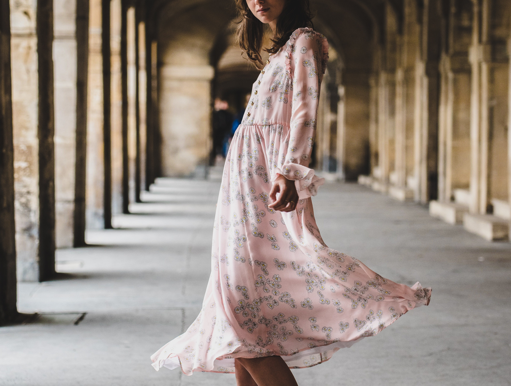
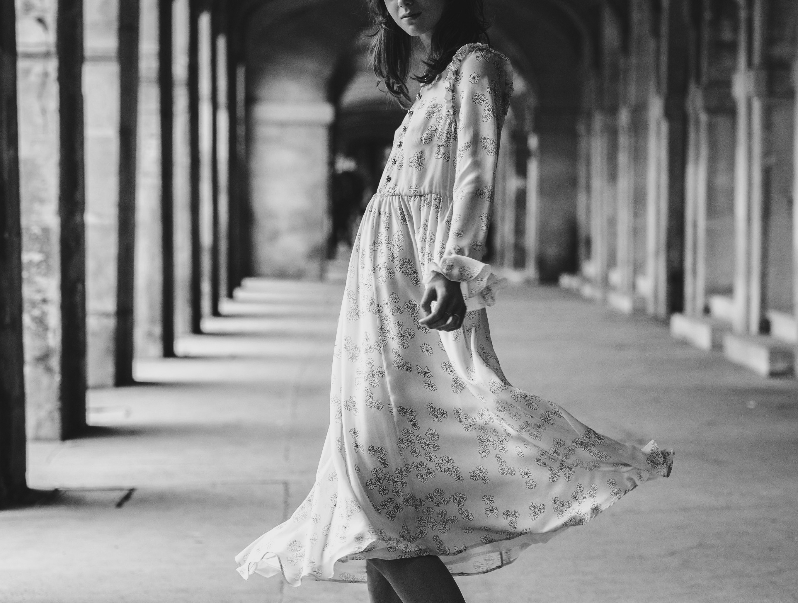

# Image Scaling Using Linear Interpolation

A Python script for image scaling implemented using the linear interpolation algorithm, with a primary focus on NumPy for efficient data manipulation. OpenCV is used only for image loading and saving.

## The script to do the following

#### Step 1: Load an image from the disk


#### Step 2: Convert the image to gray-scale (8bpp format)


#### Step 3: Re-sample the image such that the size is 0.7 times it original dimensions using linear interpolation method and save the image.


#### Step 4: Re-sample the image created in (step 3) back to its original size and save the image.


#### Step 5: Compute the sum of the average of the squared difference between pixels in the original image (in step 2) and the re-samples image in (step 4).
```txt
Original image's shape: (2057, 2723, 3)

Gray scale image's shape: (2057, 2723, 1)

Downsampled gray scale image's shape: (1440, 1906, 1)

Upsampled gray scale image's shape: (2057, 2723, 1)

=======================================================

Sum of Square Error of reconstruction: 63583531

Mean Square Error of reconstruction: 11.351747148964751

=======================================================
```
